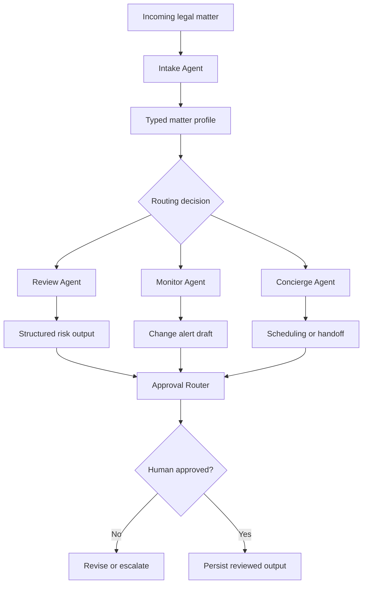

# LegalAgent Swarm

A supervised multi-agent prototype for legal operations, structured intake, risk triage, review routing and human-approved outputs.

[](https://github.com/sebastianforste/legal_agent)
[](https://github.com/sebastianforste/legal_agent)
[](https://ai.google.dev/)
[](https://github.com/sebastianforste/legal_agent)
[](./LICENSE)

## What this proves

* Legal work can be decomposed into bounded agent tasks without losing human control.
* Schema-validated handoffs are more reliable than informal prompt chains.
* A legal operations system should route, escalate, record and review before anything is acted upon.

## Overview

LegalAgent demonstrates how a coordinated set of specialised AI agents can handle structured legal operations work: matter intake, product counsel review, contract risk review, regulatory monitoring and approval workflow design.

Each agent handles a bounded task, passes typed outputs to the next stage, and routes to a human approval step before any output is persisted or acted upon. The architecture is intentionally supervisor-controlled rather than autonomous.

Core capabilities:

* Structured matter intake and classification
* Contract risk triage and routing to appropriate review workflows
* Regulatory change monitoring with summarisation and alert drafting
* Product counsel review support for privacy, AI governance and vendor contracts
* Approval gate design with escalation logic and audit trail
* Calendar routing and scheduling coordination

## Architecture

A Master Orchestrator manages asynchronous concurrent execution across specialised agents using Python AsyncIO. Each agent communicates through strict Pydantic schema contracts, ensuring all agent-to-agent data exchanges are validated before processing.



Agents:

* Intake Agent: classifies and structures incoming matters by type, urgency and routing path.
* Review Agent: applies rule-based and LLM-assisted risk analysis to contracts and regulatory documents.
* Monitor Agent: tracks regulatory sources and generates structured change alerts.
* Concierge Agent: handles scheduling, routing and human-in-the-loop handoff.

Additional modules:

* Signal Hunter: regulatory and case-law alerting concept.
* Approval Router: escalation triggers, data minimisation and reusable legal playbooks.

## Tech stack

* Language: Python 3.12+
* Concurrency: `asyncio`, `aiohttp`
* AI model: Google Gemini Pro / Flash
* Data validation: Pydantic v2
* Build and CI: `uv`, `ruff`, `mypy`, GitHub Actions
* Testing: `pytest`, `pytest-asyncio`

## Quick start

Prerequisites: Python 3.12+ and a Google Gemini API key.

```bash
git clone https://github.com/sebastianforste/legal_agent
cd legal_agent
pip install -r requirements.txt
cp .env.example .env
python master_orchestrator.py
```

## Launch readiness

For a reviewer-friendly runbook covering demo path, checks, sample-data rules, architecture and safety posture, see [`docs/launch-readiness.md`](docs/launch-readiness.md).

## Legal-tech domain concepts

The project covers:

* Contract lifecycle monitoring and review workflow triggers
* Compliance automation and structured change summaries
* Legal process optimisation through triage, routing and approval gates
* Audit trail design with schema-validated outputs

## Key design decisions

1. Human-in-the-loop by default: no output is acted upon without an explicit approval step.
2. Schema-first communication: Pydantic contracts enforce data integrity across agent boundaries.
3. High-concurrency AsyncIO: intake items can be processed without blocking the review pipeline.
4. Modular agents: each agent can be tested, replaced or extended independently.

## Safety note

This is a prototype. It does not provide legal advice. Consequential legal work requires professional review, source verification and organisation-specific controls.

## Security

API keys are managed via `.env` and never logged. All LLM outputs undergo Pydantic schema validation before persistence. See [SECURITY.md](./SECURITY.md) for responsible disclosure.

## Contact

Built by Sebastian Förste: [github.com/sebastianforste](https://github.com/sebastianforste)