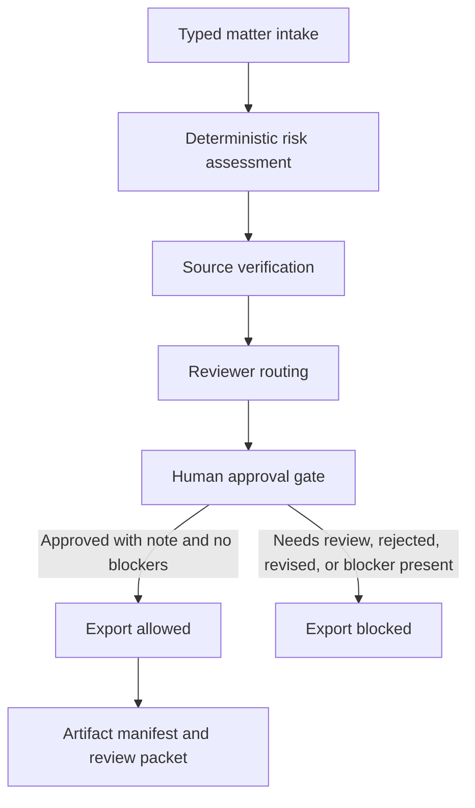

# LegalOps Agent

LegalOps Agent turns recurring legal work into bounded, typed tasks: matter intake, contract risk triage, source verification, reviewer routing and human-approved outputs. It exposes its workflow as a local MCP server with six controlled tools, so an agent platform can call legal operations the way it calls any other tool, with deterministic rules before model synthesis and a human approval gate before anything is persisted or acted on.

Designed for AI-native SaaS teams where legal needs to be available inside product and revenue workflows, but consequential decisions still require accountable human approval.

[](https://github.com/sebastianfoerste/legal-ops-agent)
[](https://github.com/sebastianfoerste/legal-ops-agent)
[](./LICENSE)

For evaluator context, start with the 90-second path below, the
[Evaluator Guide](docs/evaluator-guide.md), the examples and the tests.


## 90-second evaluator path

```bash
python3.13 -m venv .venv
source .venv/bin/activate
make install
python -m src.cli --input examples/matters/saas_msa_deviation.json
```

The first run returns `review_state: "needs_review"` and
`export_allowed: false`. Inspect the risk decision, reviewer routing, source
verification records and audit trail in the JSON output.

Approve the same synthetic matter with a documented human decision:

```bash
python -m src.cli \
  --input examples/matters/saas_msa_deviation.json \
  --approve-note "Approved after commercial counsel review of the synthetic MSA deviation." \
  --packet-output demo_output/saas-msa-review-packet.md \
  --manifest-output demo_output/saas-msa-artifact-manifest.json
```

Export remains blocked until approval is recorded, and it remains blocked after
approval if a blocker finding is still present.

Run the public proof gate:

```bash
make check
```

## Core workflow



## Design principles

- Human review before consequential use.
- Deterministic rules before model synthesis.
- Pydantic schemas for every handoff.
- Review notes required for approval, rejection and escalation.
- Blocked source prefixes for client, candidate, privileged and confidential material.
- Public regulatory source verification without external fetching.
- Local MCP configuration for controlled tool access.
- Synthetic sample data only.

## Repository structure

- [`models.py`](models.py): Pydantic contracts for matters, findings, routing, review decisions and assessments.
- [`src/legal_ops.py`](src/legal_ops.py): Deterministic intake, risk and routing workflow.
- [`src/source_verification.py`](src/source_verification.py): Source-boundary verification for synthetic and public regulatory references.
- [`src/exports.py`](src/exports.py): Customer-commitment register export.
- [`src/mcp_tools.py`](src/mcp_tools.py): Local tool manifest and tool dispatcher for MCP-style integrations.
- [`src/review_packet.py`](src/review_packet.py): Markdown review-packet renderer for legal sign-off.
- [`src/cli.py`](src/cli.py): Fixture-driven command line entry point.
- [`examples/matters/`](examples/matters): Synthetic SaaS, DPA, AI-vendor, product and regulatory-monitoring fixtures.
- [`examples/clauses/`](examples/clauses): Synthetic redacted clause fixtures.
- [`runtime_agent/app.py`](runtime_agent/app.py): Small HTTP canary for health checks and local workflow calls.
- [`mcp.json`](mcp.json): Explicit local MCP server configuration.
- [`tests/`](tests): Unit tests for validation, risk logic, review gates, MCP manifest and runtime behavior.

## Quick start

Prerequisites: Python 3.13+.

```bash
git clone https://github.com/sebastianfoerste/legal-ops-agent
cd legal-ops-agent
python -m pip install -r requirements.lock
python master_orchestrator.py
```

The demo uses synthetic data and does not call an external model by default.

To assess a fixture and write a reviewer-ready packet:

```bash
python -m src.cli \
  --input examples/matters/enterprise_dpa.json \
  --json-output demo_output/assessment.json \
  --packet-output demo_output/review-packet.md \
  --commitments-output demo_output/customer-commitments.json \
  --sources-output demo_output/source-verification.json \
  --review-runner-output demo_output/source-verified-review-runner.json \
  --manifest-output demo_output/artifact-manifest.json
```

The manifest records SHA-256 digests for each generated review artifact and a
local integrity signature over the digest set. It is designed for reviewer
traceability. It is not an eIDAS signature.

## Checks

```bash
make check
```

This runs Ruff, Black, MyPy and Pytest.

## MCP surface

`mcp.json` exposes a local `legal-ops-agent` server with six controlled tools:

- `legal.matter.assess`: create a structured assessment from a typed legal matter.
- `legal.review.decide`: apply a documented human review decision.
- `legal.review.packet`: render a markdown review packet from an assessment.
- `legal.review.packet.run`: assess a matter and return the source-verified packet, source manifest and policy envelope in one payload.
- `legal.sources.list`: show the public or synthetic source boundary for the demo.
- `legal.sources.verify`: verify source-reference boundaries without fetching external content.

These tools are designed for local evaluation. They do not send client, candidate, matter or account data to an external system.

See [docs/API.md](docs/API.md) for input schemas, output schemas, safety limits
and example calls.

## What this proves

This repository demonstrates supervised legal operations as software. It shows
typed intake, deterministic triage, source-boundary controls, reviewer routing,
human approval gates, artifact manifests and local MCP-style tool calls. The
important signal is the control model: automation prepares the matter, but a
qualified human decision controls export.

## Safety note

This is a prototype. It does not provide legal advice, legal representation or filing-ready regulatory conclusions. Consequential legal work requires qualified human review, source verification and organisation-specific controls.

## Contact

Built by Sebastian Förste: [github.com/sebastianfoerste](https://github.com/sebastianfoerste)
