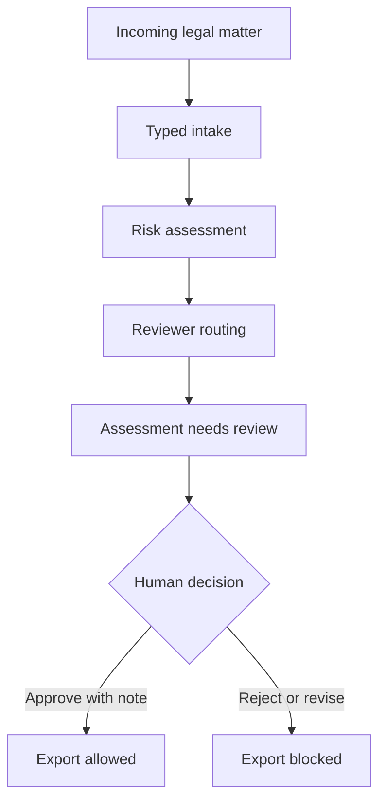

# LegalAgent

LegalAgent is a supervised multi-agent prototype for legal operations. It decomposes recurring legal work into bounded tasks: matter intake, contract risk triage, regulatory monitoring, product counsel routing, and approval workflow design.

The architecture is intentionally controlled. Agents exchange typed outputs, escalation rules determine review paths, and consequential outputs require human approval before they are persisted or acted upon.

[](https://github.com/sebastianfoerste/legal-ops-agent)
[](https://github.com/sebastianfoerste/legal-ops-agent)
[](./LICENSE)

## What this proves

LegalAgent shows how legal work can move through software without pretending that software is the lawyer. It turns an incoming matter into a typed intake record, deterministic risk findings, reviewer routing and an explicit review state. Export stays blocked until a human reviewer approves the assessment with a written note.

The repository is intentionally narrow. It is a public proof of legal infrastructure for AI-native SaaS teams: contract intake, DPA triage, AI vendor review, product-launch review, customer commitments, regulatory monitoring and approval gates.

See [What This Proves for a General Counsel Candidate](what-this-proves.md) and [Sample Output Logs](sample-output.md) for more details.

## Core workflow



## Design principles

- Human review before consequential use.
- Deterministic rules before model synthesis.
- Pydantic schemas for every handoff.
- Review notes required for approval, rejection and escalation.
- Blocked source prefixes for client, candidate, privileged and confidential material.
- Local MCP configuration for controlled tool access.
- Synthetic sample data only.

## Repository structure

- [`models.py`](models.py): Pydantic contracts for matters, findings, routing, review decisions and assessments.
- [`src/legal_ops.py`](src/legal_ops.py): Deterministic intake, risk and routing workflow.
- [`src/exports.py`](src/exports.py): Customer-commitment register export.
- [`src/mcp_tools.py`](src/mcp_tools.py): Local tool manifest and tool dispatcher for MCP-style integrations.
- [`src/review_packet.py`](src/review_packet.py): Markdown review-packet renderer for legal sign-off.
- [`src/cli.py`](src/cli.py): Fixture-driven command line entry point.
- [`examples/matters/`](examples/matters): Synthetic matter intake fixtures.
- [`examples/clauses/`](examples/clauses): Synthetic redacted clause fixtures.
- [`runtime_agent/app.py`](runtime_agent/app.py): Small HTTP canary for health checks and local workflow calls.
- [`mcp.json`](mcp.json): Explicit local MCP server configuration.
- [`tests/`](tests): Unit tests for validation, risk logic, review gates, MCP manifest and runtime behavior.

## Quick start

Prerequisites: Python 3.12+.

```bash
git clone https://github.com/sebastianfoerste/legal-ops-agent
cd legal-ops-agent
python -m pip install -r requirements.lock
python master_orchestrator.py
```

The demo uses synthetic data and does not call an external model by default.

To assess a fixture and write a reviewer-ready packet:

```bash
python -m src.cli \
  --input examples/matters/enterprise_dpa.json \
  --json-output demo_output/assessment.json \
  --packet-output demo_output/review-packet.md \
  --commitments-output demo_output/customer-commitments.json
```

## Checks

```bash
make check
```

This runs Ruff, Black, MyPy and Pytest.

## MCP surface

`mcp.json` exposes a local `legal-ops-agent` server with four controlled tools:

- `legal.matter.assess`: create a structured assessment from a typed legal matter.
- `legal.review.decide`: apply a documented human review decision.
- `legal.review.packet`: render a markdown review packet from an assessment.
- `legal.sources.list`: show the public or synthetic source boundary for the demo.

These tools are designed for local evaluation. They do not send client, candidate, matter or account data to an external system.

## Safety note

This is a prototype. It does not provide legal advice, legal representation or filing-ready regulatory conclusions. Consequential legal work requires qualified human review, source verification and organisation-specific controls.

## Contact

Built by Sebastian Förste: [github.com/sebastianfoerste](https://github.com/sebastianfoerste)
