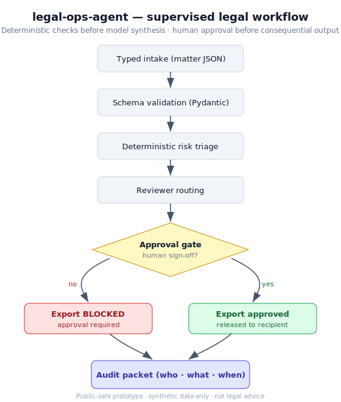
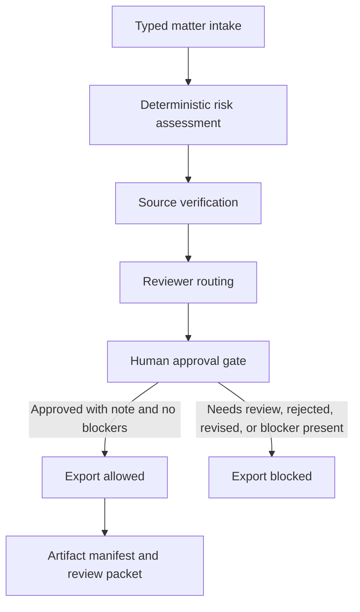

# legal-ops-agent

[](https://github.com/sebastianfoerste/legal-ops-agent/actions/workflows/ci.yml)

CI: passing. Deterministic test suite: 46 checks.

See [CASE_STUDY.md](CASE_STUDY.md) for the problem, controls, and limitations.

Supervised legal-operations workflow: typed intake, deterministic risk triage, reviewer routing, human-approved export, audit trail. Legal advice is outside this prototype; data is synthetic.

**Public-safety posture:** synthetic matters only, explicit source provenance checks, an audit trail, a human review gate before export, and no legal advice.

> **If you don't code:** scroll to [What the demo produces](#what-the-demo-produces). This repo ships a sample output you can read in the browser. The point isn't the code; it's whether the legal work is structured, cited, reviewable, and testable.




## Run it

```bash
git clone https://github.com/sebastianfoerste/legal-ops-agent
cd legal-ops-agent
python3.13 -m venv .venv
source .venv/bin/activate
make install
python -m src.cli --input examples/matters/saas_msa_deviation.json
```

Runs the canonical evaluator path end to end, offline and deterministically, over a
synthetic SaaS MSA deviation fixture.

## Architecture flow

1. `models.py` defines typed matter, finding, routing, review and assessment contracts.
2. `src/legal_ops.py` performs deterministic intake, risk triage and reviewer routing.
3. `src/source_verification.py` validates synthetic and public-regulatory source references.
4. `src/mcp_tools.py` exposes seven local MCP-style tools behind a controlled dispatcher.
5. `src/trust_cockpit.py` renders the reviewer-facing trust cockpit.
6. `src/review_packet.py` renders the lawyer-facing Markdown packet.
7. `src/cli.py` runs fixture-to-packet flows for evaluator review.
8. `runtime_agent/app.py` provides a small HTTP canary for local workflow checks.
9. Export stays blocked until a documented human approval clears the review gate.

## What the demo produces

The workflow runs triage over a matter intake, generates deterministic findings, and routes to reviewers. Export remains blocked until a human reviewer records an approval decision. You can read the committed sample output: [`examples/matter-run.md`](examples/matter-run.md). The current source-verified proof snapshot is [`examples/source-verified-saas-msa-run-2026-06-30.md`](examples/source-verified-saas-msa-run-2026-06-30.md). The reviewer-facing trust cockpit snapshot is [`examples/trust-cockpit-saas-msa-2026-06-30.md`](examples/trust-cockpit-saas-msa-2026-06-30.md).

```markdown
# LegalOps Review Packet: Enterprise customer DPA review

- Review state: approved
- Export: allowed

## Routing
- Owner role: Privacy Counsel
- Reviewers: Legal Ops, Privacy Counsel, AI Governance Lead, Commercial Counsel, General Counsel

## Findings
- MEDIUM: privacy | Personal or customer data categories are in scope.
- HIGH: customer_commitments | The matter includes bespoke customer commitments.
- MEDIUM: ai_governance | AI processing or model-training restrictions require review.
```

In the sample run, export stays blocked until a reviewer approves; the audit trail shows who and when.

## What it checks / does

| Check / Step | Focus | Verification Method |
|---|---|---|
| Typed Matter Intake | Input validation | Ensures all details are provided according to strict Pydantic models |
| Risk Triage | Deterministic risk scoring | Catches known issues (e.g. data retention demands, specific vendor terms) |
| Source Verification | Provenance tracking | Verifies that references use allowed source prefixes and formats |
| Trust Cockpit | Reviewer evidence | Shows review state, source boundary, export gate, commitments and artifact integrity |
| Audit Integrity Chain | Tamper evidence | Hash-chains every audit event; export is blocked if the chain does not verify |

> **What workflow does this improve?** Recurring legal operations triage and gating.
> **Who is the user?** A General Counsel or Legal Operations lead running the workflow.
> **Where does human review happen?** At the Review Gate, which must be approved by the GC.
> **What is blocked until approval?** Persisted output and downstream data export.
> **What would I tell Product?** Real-world friction patterns and common DPA deviations to automate them in templates.


## 90-second evaluator path

```bash
python3.13 -m venv .venv
source .venv/bin/activate
make install
python -m src.cli --input examples/matters/saas_msa_deviation.json
```

The first run returns `review_state: "needs_review"` and
`export_allowed: false`. Inspect the risk decision, reviewer routing, source
verification records and audit trail in the JSON output.

Approve the same synthetic matter with a documented human decision:

```bash
python -m src.cli \
  --input examples/matters/saas_msa_deviation.json \
  --approve-note "Approved after commercial counsel review of the synthetic MSA deviation." \
  --packet-output demo_output/saas-msa-review-packet.md \
  --manifest-output demo_output/saas-msa-artifact-manifest.json
```

Export remains blocked until approval is recorded, and it remains blocked after
approval if a blocker finding is still present.

Run the public proof gate:

```bash
make check
```

## Committed source-verified proof

A dated proof run for the same synthetic SaaS MSA deviation fixture is committed
here:

- [`examples/source-verified-saas-msa-run-2026-06-30.md`](examples/source-verified-saas-msa-run-2026-06-30.md)
- [`examples/source-verified-saas-msa-run-2026-06-30.json`](examples/source-verified-saas-msa-run-2026-06-30.json)

The snapshot records `review_state: "needs_review"`, `export_allowed: false`,
`external_actions_allowed: false`, a synthetic source-reference pass and a
`local_review_only` policy envelope. Generated review artifacts are locally
manifestable with SHA-256 digests.

## Committed trust cockpit proof

The Trust Cockpit is the reviewer-grade proof surface added after competitive
research across GitHub, mobile app stores and relevant app marketplaces. The
research note is here: [`docs/competitive-research-2026-06-30.md`](docs/competitive-research-2026-06-30.md).

- [`examples/trust-cockpit-saas-msa-2026-06-30.md`](examples/trust-cockpit-saas-msa-2026-06-30.md)
- [`examples/trust-cockpit-saas-msa-2026-06-30.json`](examples/trust-cockpit-saas-msa-2026-06-30.json)

The cockpit snapshot records the same synthetic SaaS MSA fixture, the canonical
CLI command, schema version, Python version, review state, disabled external
actions, source boundary, commitments, owners, SLA, local artifact digests and
next actions.

## Committed audit chain proof

The audit trail is a SHA-256 hash chain: each event commits to the hash of the one
before it, so altering, reordering or dropping a past event is detectable, and export
is blocked if the chain does not verify.

- [`examples/audit-chain-saas-msa-2026-06-30.json`](examples/audit-chain-saas-msa-2026-06-30.json)

The snapshot is generated from the same synthetic SaaS MSA fixture after a documented
human approval, and shows a two-event chain (`assessment_created`,
`review_decision_applied`) that verifies.

## Core workflow



## Design principles

- Human review before consequential use.
- Deterministic rules before model synthesis.
- Pydantic schemas for every handoff.
- Review notes required for approval, rejection and escalation.
- Blocked source prefixes for client, candidate, privileged and confidential material.
- Public regulatory source verification without external fetching.
- Local MCP configuration for controlled tool access.
- Synthetic sample data only.

## Repository structure

- [`models.py`](models.py): Pydantic contracts for matters, findings, routing, review decisions and assessments.
- [`src/legal_ops.py`](src/legal_ops.py): Deterministic intake, risk and routing workflow.
- [`src/source_verification.py`](src/source_verification.py): Source-boundary verification for synthetic and public regulatory references.
- [`src/exports.py`](src/exports.py): Customer-commitment register export.
- [`src/mcp_tools.py`](src/mcp_tools.py): Local tool manifest and tool dispatcher for MCP-style integrations.
- [`src/trust_cockpit.py`](src/trust_cockpit.py): Reviewer-facing trust cockpit builder and renderers.
- [`src/audit_chain.py`](src/audit_chain.py): Tamper-evident hash chain builder for the audit trail.
- [`src/review_packet.py`](src/review_packet.py): Markdown review-packet renderer for legal sign-off.
- [`src/cli.py`](src/cli.py): Fixture-driven command line entry point.
- [`examples/matters/`](examples/matters): Synthetic SaaS, DPA, AI-vendor, product and regulatory-monitoring fixtures.
- [`examples/clauses/`](examples/clauses): Synthetic redacted clause fixtures.
- [`runtime_agent/app.py`](runtime_agent/app.py): Small HTTP canary for health checks and local workflow calls.
- [`mcp.json`](mcp.json): Explicit local MCP server configuration.
- [`tests/`](tests): Unit tests for validation, risk logic, review gates, MCP manifest and runtime behavior.

## Generate review artifacts

To assess a synthetic fixture and write the reviewer-ready artifacts:

```bash
python -m src.cli \
  --input examples/matters/saas_msa_deviation.json \
  --json-output demo_output/assessment.json \
  --packet-output demo_output/review-packet.md \
  --commitments-output demo_output/customer-commitments.json \
  --sources-output demo_output/source-verification.json \
  --review-runner-output demo_output/source-verified-review-runner.json \
  --manifest-output demo_output/artifact-manifest.json \
  --audit-chain-output demo_output/audit-chain.json \
  --trust-cockpit-output demo_output/trust-cockpit.md \
  --trust-cockpit-json-output demo_output/trust-cockpit.json
```

The manifest records SHA-256 digests for each generated review artifact and a
local integrity signature over the digest set. It is designed for reviewer
traceability. It is not an eIDAS signature.

## Checks

```bash
make check
```

This runs Ruff, Black, MyPy and Pytest.

## MCP surface

`mcp.json` exposes a local `legal-ops-agent` server with eight controlled tools:

- `legal.matter.assess`: create a structured assessment from a typed legal matter.
- `legal.review.decide`: apply a documented human review decision.
- `legal.review.packet`: render a markdown review packet from an assessment.
- `legal.review.packet.run`: assess a matter and return the source-verified packet, source manifest and policy envelope in one payload.
- `legal.review.trust_cockpit`: assess a matter and return reviewer evidence for review gates, source boundary, commitments and artifact integrity.
- `legal.audit.verify`: verify the tamper-evident hash chain on an assessment's audit trail.
- `legal.sources.list`: show the public or synthetic source boundary for the demo.
- `legal.sources.verify`: verify source-reference boundaries without fetching external content.

These tools are designed for local evaluation. They do not send client, candidate, matter or account data to an external system.

See [docs/API.md](docs/API.md) for input schemas, output schemas, safety limits
and example calls.

## What this proves

This repository demonstrates supervised legal operations as software. It shows
typed intake, deterministic triage, source-boundary controls, reviewer routing,
human approval gates, artifact manifests and local MCP-style tool calls. The
important signal is the control model: automation prepares the matter, but a
qualified human decision controls export.

## Safety note

This is a prototype. It does not provide legal advice, legal representation or filing-ready regulatory conclusions. Consequential legal work requires qualified human review, source verification and organisation-specific controls.

## Contact

Built by Sebastian Förste: [github.com/sebastianfoerste](https://github.com/sebastianfoerste)

## Human-authored legal judgment
AI tools assisted the implementation, but the parts that carry the value are
human-authored: the legal answer sets, risk taxonomy, escalation logic, citations,
and review states. The point of this repository is not code volume; it is showing
how legal judgment can be made structured, testable, and reviewable.

## Why lawyers should care
It keeps agentic work accountable: structured intake, visible assumptions, and an
approval gate that blocks export until a human signs off, with an audit trail.

## Why product teams should care
It is a reference pattern for safe agentic actions: deterministic checks before model
synthesis, typed schemas, routing by risk, and export control, the parts a security
or risk reviewer asks about before a tool ships.

## Known limitations
A public-safe prototype, not a production system.
1. Synthetic matters only; no real DMS, identity provider, or e-signature.
2. Triage thresholds are illustrative defaults, to be tuned per team.
3. The audit trail is tamper-evident (hash-chained, verifiable with `legal.audit.verify`)
   but still in-process, not persisted to an append-only external store.
4. Roles/permissions are modelled, not enforced against a real IdP.
Next production step: real auth for approval tiers, ticketing integration, live SLA
tracking, and persisting the hash-chained audit log to an append-only external store.
