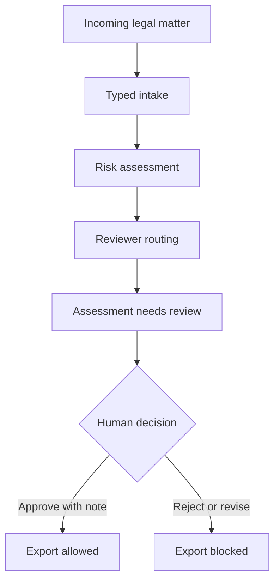

# LegalOps Agent

Supervised legal-operations agent for intake, risk triage, review routing and human-approved outputs.

[](https://github.com/sebastianfoerste/legal-ops-agent)
[](https://github.com/sebastianfoerste/legal-ops-agent)
[](./LICENSE)

## What this proves

LegalOps Agent shows how legal work can move through software without pretending that software is the lawyer. It turns an incoming matter into a typed intake record, deterministic risk findings, reviewer routing and an explicit review state. Export stays blocked until a human reviewer approves the assessment with a written note.

The repository is intentionally narrow. It is a public proof of legal infrastructure for AI-native SaaS teams: contract intake, DPA triage, AI vendor review, product-launch review, customer commitments, regulatory monitoring and approval gates.

## Core workflow



## Design principles

- Human review before consequential use.
- Deterministic rules before model synthesis.
- Pydantic schemas for every handoff.
- Review notes required for approval, rejection and escalation.
- Local MCP configuration for controlled tool access.
- Synthetic sample data only.

## Repository structure

- [`models.py`](models.py): Pydantic contracts for matters, findings, routing, review decisions and assessments.
- [`src/legal_ops.py`](src/legal_ops.py): Deterministic intake, risk and routing workflow.
- [`src/mcp_tools.py`](src/mcp_tools.py): Local tool manifest and tool dispatcher for MCP-style integrations.
- [`runtime_agent/app.py`](runtime_agent/app.py): Small HTTP canary for health checks and local workflow calls.
- [`mcp.json`](mcp.json): Explicit local MCP server configuration.
- [`tests/`](tests): Unit tests for validation, risk logic, review gates, MCP manifest and runtime behavior.

## Quick start

Prerequisites: Python 3.12+.

```bash
git clone https://github.com/sebastianfoerste/legal-ops-agent
cd legal-ops-agent
python -m pip install -r requirements.lock
python master_orchestrator.py
```

The demo uses synthetic data and does not call an external model by default.

## Checks

```bash
make check
```

This runs Ruff, Black, MyPy and Pytest.

## MCP surface

`mcp.json` exposes a local `legal-ops-agent` server with three controlled tools:

- `legal.matter.assess`: create a structured assessment from a typed legal matter.
- `legal.review.decide`: apply a documented human review decision.
- `legal.sources.list`: show the public or synthetic source boundary for the demo.

These tools are designed for local evaluation. They do not send client, candidate, matter or account data to an external system.

## Safety note

This is a prototype. It does not provide legal advice, legal representation or filing-ready regulatory conclusions. Consequential legal work requires qualified human review, source verification and organisation-specific controls.

## Contact

Built by Sebastian Förste: [github.com/sebastianfoerste](https://github.com/sebastianfoerste)
