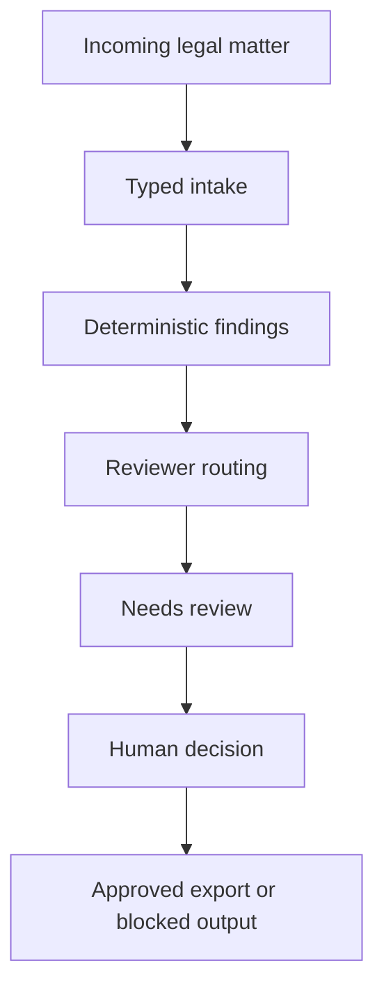

# Launch Readiness

This document explains how to evaluate and run LegalOps Agent.

## What this repo proves

LegalOps Agent demonstrates supervised legal-operations architecture for AI-native SaaS teams. It decomposes legal work into typed intake, deterministic risk findings, review routing and documented human approval.

The core proof is controlled orchestration. Legal tasks move through typed stages, and no consequential output is exported until a reviewer approves it with a written note.

## Architecture



## Local launch path

```bash
git clone https://github.com/sebastianfoerste/legal-ops-agent
cd legal-ops-agent
python -m pip install -r requirements.lock
python master_orchestrator.py
```

External model calls are disabled by default. Set `LEGAL_AGENT_EXTERNAL_MODEL_ENABLED=true` only for approved test data.

## Runtime canary

```bash
PORT=18085 python -m runtime_agent.app
curl -fsS http://127.0.0.1:18085/health
curl -fsS http://127.0.0.1:18085/mcp/manifest
```

## Checks

```bash
make check
python -m compileall master_orchestrator.py models.py src runtime_agent tests
```

## Sample data rule

Use synthetic matters, public regulatory examples and mock commercial terms. Do not process privileged legal advice, client documents, employee data, personal data or confidential commercial terms in external AI tools without explicit approvals.

## Good evaluator route

A reviewer should inspect the README, `models.py`, `src/legal_ops.py`, `src/mcp_tools.py`, `runtime_agent/app.py`, the tests and `SECURITY.md`. The key signal is that the architecture treats agents as controlled workflow components with source boundaries and review gates.
