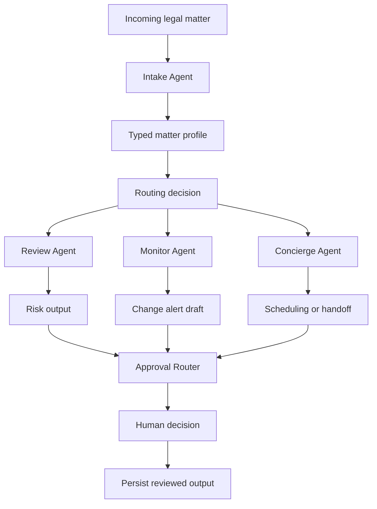

# Launch Readiness

This document explains how to evaluate and run LegalAgent Swarm.

## What this repo proves

LegalAgent Swarm demonstrates supervised multi-agent architecture for legal operations. It decomposes legal work into bounded agents for intake, review, monitoring, concierge routing and approval. The system emphasizes schema-validated handoffs, escalation logic, auditability and human approval.

The core proof is not autonomous legal advice. The core proof is controlled orchestration: legal tasks move through typed stages and no consequential output is acted on without review.

## Architecture



## Local launch path

```bash
git clone https://github.com/sebastianforste/legal_agent
cd legal_agent
pip install -r requirements.txt
cp .env.example .env
python master_orchestrator.py
```

If the Gemini integration is enabled, set the relevant API key in `.env`. Keep external model calls disabled or mocked when testing confidential workflows.

## Demo path

1. Start the orchestrator locally.
2. Submit a synthetic legal matter.
3. Inspect the structured intake output.
4. Follow routing to review, monitoring or concierge agents.
5. Confirm Pydantic validation on agent handoffs.
6. Inspect the approval gate before persistence or action.
7. Show how rejected outputs are revised or escalated.

## Checks

```bash
pytest
pytest -q
ruff check .
mypy .
python -m compileall .
```

If a narrower command set is defined in the repo, prefer that project-specific check script.

## Sample data rule

Use synthetic matters, synthetic contracts, public regulatory examples and mock calendar data. Do not process privileged legal advice, client documents, employee data, recruiting targets or confidential commercial terms in external AI tools without approvals.

## Safety posture

LegalAgent is a prototype. It should support supervised legal operations, not independent practice of law. Every output that affects legal rights, regulatory position, client communications or business commitments requires qualified human review.

## Good evaluator route

A reviewer should inspect the README, this file, the orchestrator, the Pydantic models, the individual agents, the approval router, tests and `SECURITY.md`. The key signal is that the architecture treats agents as controlled workflow components rather than magic legal decision-makers.